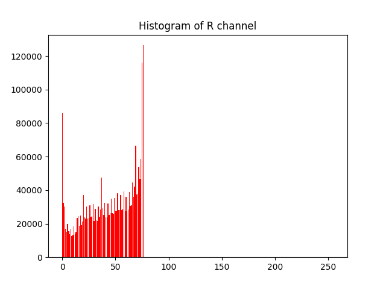
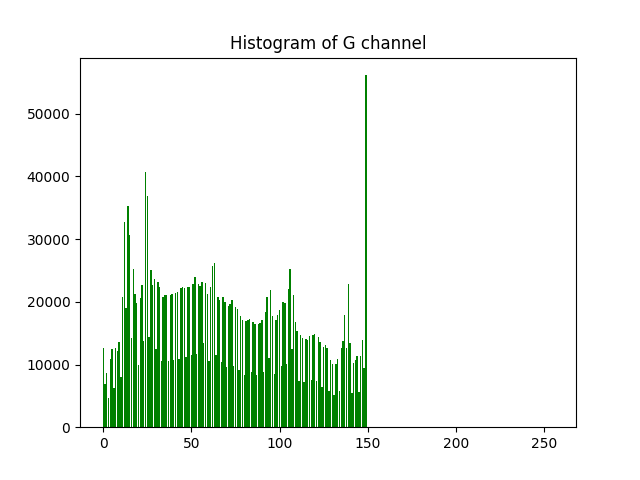

# Compute histogram of color image

import necessay libs
```
import cv2
import numpy as np
import matplotlib.pyplot as plt
```

# histogam of red, green, blue  channels 

1- Read image  0 for gray image 1 fo color image
```
img=cv2.imread("image.jpg",1) 
```
2- Split image into 3 channels
```
img_rgb = cv2.cvtColor(img, cv2.COLOR_BGR2RGB)

```
3- Copy image 
```
B = img.copy() 
G = img.copy()
R = img.copy()
```

4- Extract red channel, green channel and blue channel
```
B[:,:,1] = B[:,:,2] = 0
G[:,:,0] = G[:,:,2] = 0
R[:,:,0] = R[:,:,1] = 0
```

5- Save red, green and blue channels as separate images
```
cv2.imwrite('R.png', R)
cv2.imwrite('G.png', G)
cv2.imwrite('B.png', B)
```


6- Convert images to grayscale
```
R_gray = cv2.imread('R.png',0)
G_gray = cv2.imread('G.png',0)
B_gray = cv2.imread('B.png',0)
```


7- Create histogram for each channel
```
hist_R,bins_R = np.histogram(R_gray.ravel(),256,[0,256])
hist_G,bins_G = np.histogram(G_gray.ravel(),256,[0,256])
hist_B,bins_B = np.histogram(B_gray.ravel(),256,[0,256])
```
8- Plot histogram for each channel
```
plt.title("Histogram of B channel")
plt.bar(range(256), hist_R, color = "red")
```

```
plt.bar(range(256), hist_G, color = "Green")
```

```
plt.bar(range(256), hist_B, color = "Blue")
```

```
plt.show()
```

